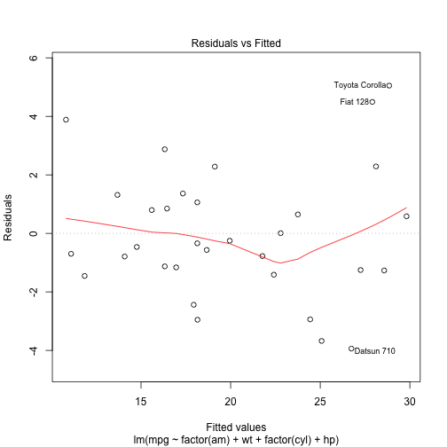

Predicting MPG
========================================================
author: Mike 
date: 7/14/2015

The Objective
========================================================

Building a new car requires substantial investment and building a car with low miles per gallon could be catastrphic on the return. The shiny app shows uses a simple regression algorithm to predict miles per gallon using the following data elements. 

- Tranmission Type
- Weight
- Number of Cylenders
- Horsepower

Regression Model Overview
========================================================


```

Call:
lm(formula = mpg ~ factor(am) + wt + factor(cyl) + hp, data = mtcars)

Residuals:
    Min      1Q  Median      3Q     Max 
-3.9387 -1.2560 -0.4013  1.1253  5.0513 

Coefficients:
             Estimate Std. Error t value Pr(>|t|)    
(Intercept)  33.70832    2.60489  12.940 7.73e-13 ***
factor(am)1   1.80921    1.39630   1.296  0.20646    
wt           -2.49683    0.88559  -2.819  0.00908 ** 
factor(cyl)6 -3.03134    1.40728  -2.154  0.04068 *  
factor(cyl)8 -2.16368    2.28425  -0.947  0.35225    
hp           -0.03211    0.01369  -2.345  0.02693 *  
---
Signif. codes:  0 '***' 0.001 '**' 0.01 '*' 0.05 '.' 0.1 ' ' 1

Residual standard error: 2.41 on 26 degrees of freedom
Multiple R-squared:  0.8659,	Adjusted R-squared:  0.8401 
F-statistic: 33.57 on 5 and 26 DF,  p-value: 1.506e-10
```

Regression Diagnostics
========================================================

 

Sample Prediction
========================================================

```r
test_data = data.frame(am = 1, wt = 2, cyl = 6, hp = 220)
mpg = predict(final_fit, test_data)
mpg
```

```
       1 
20.42846 
```

Conclusion
========================================================
Our model provides ample evidence for using these features as an initial basis for determining miles per gallon. By furthering this model, car manufactures can better predict the miles per gallon of a new car before going into production and increase their return on investment. 
